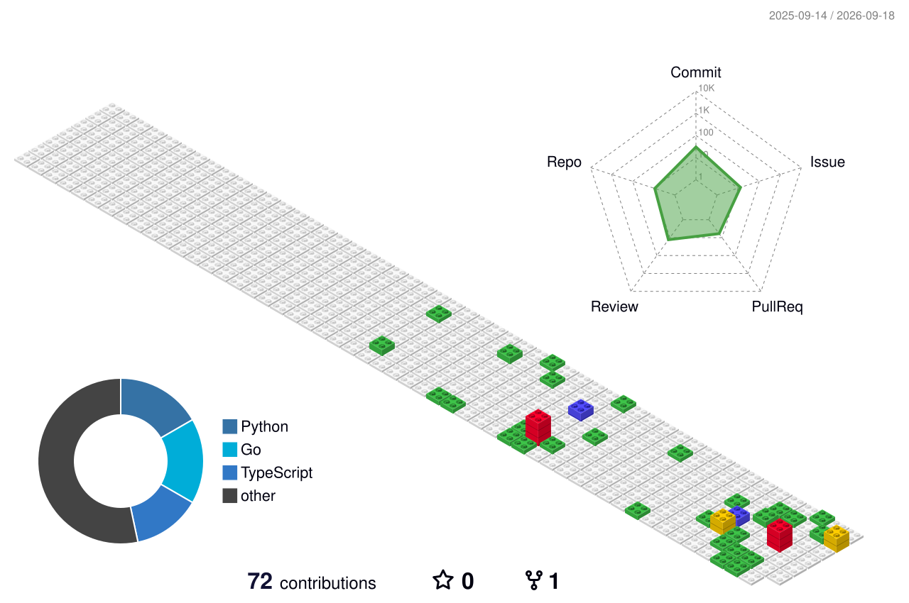

---

###  关于我 / About Me

🌐 I'm currently focused on **Agentic Workflow**, **LLM Infra**, and **Distributed Systems**.
🐼 Born 2004.05.12 · Hangzhou, China. 📍 Based in 杭州.

#### 💼 Work Experience
- [**Humanify**](https://humanify.io/) — AI Agent Engineer · 构建生产级 Agent 运行时（planning、tool routing、eval pipeline）

#### 💻 Open Source Experience
- [Apache Seata-Go](https://github.com/apache/incubator-seata-go) — **Committer** · 分布式事务 Go 实现核心模块
- AI Agent OSS contributor · 多个 Agent 相关项目维护

#### 🌱 Currently Exploring
- LLM serving (vLLM / SGLang) · Agent evaluation methodology · Multi-agent orchestration

---

###  Tech Stack

**Languages**

**AI / Agent**

**Backend & Infra**

**Tools**

---

###  GitHub Stats

<!-- 🐍 Contribution Snake -->
<picture>
  <source media="(prefers-color-scheme: dark)" srcset="https://raw.githubusercontent.com/Ethan-Xingyue/Ethan-Xingyue/output/github-contribution-grid-snake-dark.svg" />
  <source media="(prefers-color-scheme: light)" srcset="https://raw.githubusercontent.com/Ethan-Xingyue/Ethan-Xingyue/output/github-contribution-grid-snake.svg" />
  
</picture>

 
 

<!-- 🧊 3D Isometric Contributions -->

 
 

 

 

---

###  Connect with Me

 

---

⭐️ From <a href="https://github.com/Ethan-Xingyue">Ethan-Xingyue</a> · Inspired by the OSS community ❤️

